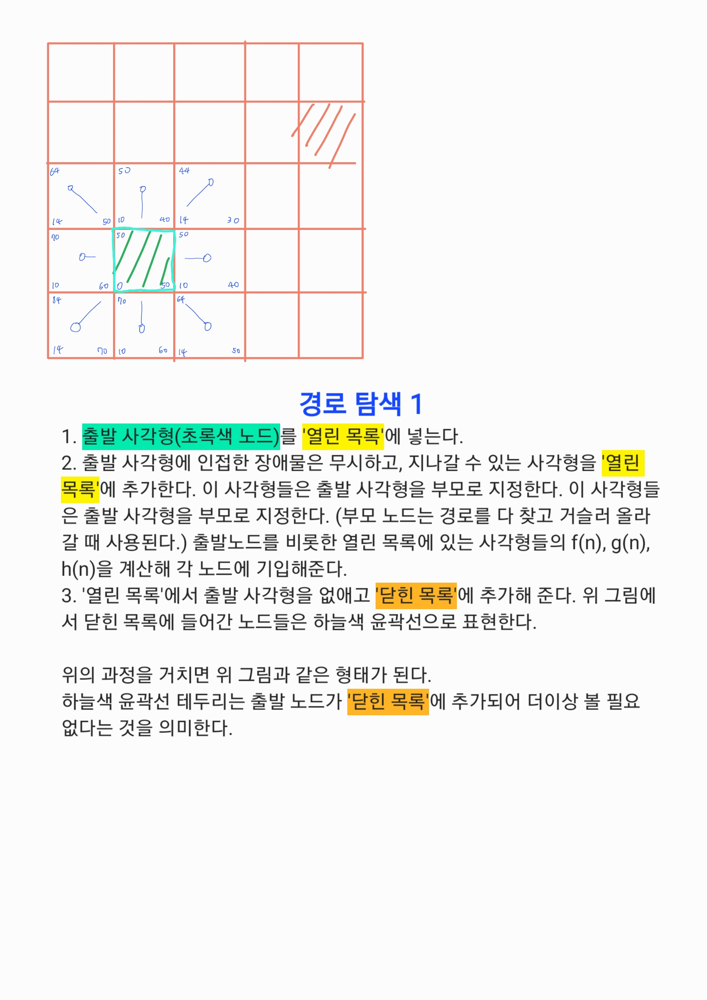
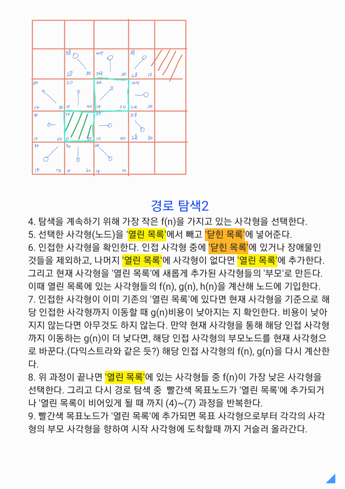

# MiniOFP

## 기본 지식

1. 지구는 타원체이지만, 계산은 '완벽한 구' 로 가정한다.

   - 계산속도의 이점, 오차가 0.5%미만으로 허용 범위 내

   - 지구 반지름 R = 3440NM(약 6371km)인 구를 사용

   - 근데 NM이 뭔데? => 지구 위도 1분 (1/60도)의 길이를 기준으로 하는 단위

   - NM 은 약 1.852km

   - 1kt (Knot) = 1시간에 1 NM을 가는 속도

2. 대권 거리

   - 지구는 평면이 아니기 때문에 피타고라스 정리를 사용하면 오차가 크게 발생한다.

   - 따라서 Harversine Formula를 이용해야 한다.

   - 공식은 다음과 같다.

$$
a = sin^2(\frac{\Delta\phi}{2}) + cos(\phi_1) \cdot cos (\phi_2) \cdot sin^2(\frac{\Delta\lambda}{2})
$$

$$
c = 2 \cdot \text{atan2}(\sqrt{a}, \sqrt{1-a})
$$

$$
d = R \cdot c
$$

여기서:

- $\phi$: 위도 (Latitude, 라디안 단위)
- $\lambda$: 경도 (Longitude, 라디안 단위)
- $R$: 지구 반지름 (약 6,371 km)

----------

### 무게와 연료

1. OEW

    - 빈 비행기의 무게(기체 + 승무원 + 기내식 등). 승객/화물/연료 뺀 상태

2. Payload

    - 돈이 되는 무게(승객 + 화물).

3. Fuel

    - 연료 무게.(**항공은 L가 아니라 kg 또는 lbs 무게로 따진다.** Why? 온도에 따른 부피 변화 때문)

4. MTOW (Maximum Take-Off Weight): 최대 이륙 중량

    - 공식: 현재 이륙 중량 = OEW + Payload + Fuel <= MTOW

### 성능 데이터 (단순화 모델)

1. TAS (True Air Speed): 진대기속도. (예: 560 kts = 1시간에 560 NM 이동)

2. Fuel Flow (FF): 시간당 연료 소모량. (예: 2500 kg/hr)

----------

### OFP는 최악의 상황을 대비해야 한다

실제 비행에서는 맞바람이 불어 더 많은 연료가 필요할 수도, 목적지에 안개가 껴 착륙을 못하는 상황이 발생 할 수도 있다.

실제 비행은 탑승자의 생명과 직결된 문제이므로 이러한 최악의 상황을 대비해야한다.

#### 이를 위한 사전 지식

1. TAS(True Air Speed):비행기가 공기를 가르는 속도.(엔진 힘)

2. Wind Component(WC): 바람 성분.

   - +(Positive): 뒤에서 밀어줌 (Tailwind) -> 빨라짐

   - -(Negative): 앞에서 때림 (Headwind) -> 느려짐

3. GS(Ground Speed): 땅에서 봤을 때 실제 이동 속도

   - 공식: GS = TAS + Wind Component

#### 연료의 구성(Block Fuel)

1. Trip Fuel: A에서 B까지 가는 데 필요한 기본 연료

2. Contingency Fuel: 기상 악화 드을 대비한 여유분 (보통 Trip Fuel의 5%)

3. Alternate Fuel: 목적지 착륙 불가 시, 인근 교체 공항까지 갈 연료

4. Final Reserve: 교체 공항 상공에서도 30~45분간 더 떠 있을 수 있는 마지막 연료.

- Block Fuel = Trip + Contingency + Alternate + Final

----------

### 실제 비행 경로문제

앞선 가정들은 목적지로 이동 할 때 직선으로 이동한다고 가정한 결과 였으나, 실제로는 항공항로가 존재하고, 해당 경로를 따라 이동해야한다.

이를 적용하기 위해서는 그래프 이론을 사용한다.

다익스트라, 또는 벨만-포드를 사용할 것이라 생각했는데 Gemini는 실제로는 항공에서 거리가 음수인 경우는 없으므로 속도가 느린 벨만-포드는 사용하지 않는다고 한다.

또한 실제로는 다익스트라의 개량형인 A*를 가장 많이 쓴다고 한다.

A*는 다익스트라의 변형이며 내가 이해한 바는 다음과 같다.

우선 grid map을 생성해서 지도를 단순화 한다.

생성된 격자 지도에서 출발지점과 목표 지점을 지정한다. 각 사각형은 빈 공간으로, '이동가능'과 '이동 불가능'한 2상태 중 하나를 갖는다.

자세한 설명은 다음 사진으로 대체

접기/펼치기

이미지로 설명한 방식은 바둑판 모양을 가정하는 게임맵 개발에 사용하는 거라는 걸 알았다.

OFP에서는 H를 직선거리(하버사인공식을 이용한)로 둔다는 걸 알게되었다.

따라서 추가 설명을 작성하고자 한다.

하늘에는 빌딩과 같은 장애물이 존재하지 않는다.

웨이 포인트는 사선으로 연결된다. 실제 비행시 경도 위도를 따라 직각으로 이동하는 것이 아니다.

여기서 이미지속 맨해튼 거리를 사용하게 되면 실제 거리보다 훨씬 길게 예측이 되어버린다.

예시로 (0,0)에서 (3,4)로 갈때 H를 실제로는 하버사인이지만 짧은 거리라고 가정하고 피타고라스로 설명하겠다.

직선거리
$$
\sqrt{3^2+4^2} = 5
$$

맨해튼법

$$
3+4=7
$$

보다싶이 맨해튼법을 사용하면 H가 7로 실제거리 5보다 커졌다. 이로 인해 A*알고리즘이 최단경로를 보장할 수 없게 되었다.

따라서 해상/항공/GPS 네비게이션 등에서는 **유클리드거리를 사용해야한다**

참고자료:

[A* 알고리즘(A star algorithm) grid map 개념 및 구현](https://recall.tistory.com/m/40)
